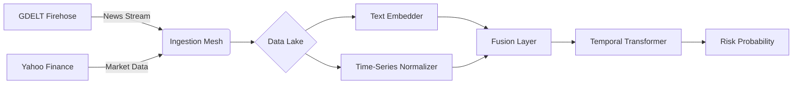

# 🌍 Sentinel: Real-World Event Prediction Engine
> A Multimodal Temporal Transformer for forecasting civil unrest and economic instability.


## 🧠 The Intelligence
Sentinel is not a sentiment analyzer. It is a **Precursor Detection System**. 
It ingests global data streams, maps them to a discrete geospatial grid (H3), and uses a **Temporal Fusion Transformer** to predict the probability of disruptive events (Riots, Economic Shocks) **24-72 hours in advance**.

### Core Architecture
* **Spatial Indexing:** Uber H3 (Hexagonal Hierarchical Spatial Index).
* **Semantic Engine:** `paraphrase-multilingual-MiniLM-L12-v2` (Transformer) for processing global news in 50+ languages.
* **Context Layer:** Real-time financial volatility injection (Oil, Wheat, Forex).
* **Model:** Custom PyTorch Transformer with Multi-Head Self-Attention for precursor discovery.

---

## 🏗️ System Pipeline



## 🚀 Quick Start

**1. Installation**

``` bash
git clone [https://github.com/adityasharmaaaaa/event_pred_engine.git](https://github.com/adityasharmaaaaa/event_pred_engine.git)

cd event_pred_engine

pip install -r requirements.txt
```

**2. Data Integration**
Scrape the latest global events and financial indicators:
```bash
python3 -m src.ingestion.gdelt_loader_v2

python3 -m src.ingestion.finance_loader
```

**3. Processing and Embeddings**

```bash
python3 -m src.preprocessing.text_embedder

python3 -m src.preprocessing.labeler
```

**4. Training**

`python3 -m src.training.train`

**5. Inference & Dashboard**

```bash
python3 -m src.inference.dashboard

uvicorn src.api.main:app --reload
```


## 📊 Explainability (XAI)
Sentinel includes an Attention Analysis Engine. It visualizes why a prediction was made by extracting the model's attention weights across the temporal window.

**Red bars** indicate the specific days/events that triggered the high-risk alert.


## 🛠️ Project Structure

```mermaid
├── configs/             # Hyperparameters & System settings
├── data/                # Data Lake (Parquet/CSV)
├── outputs/             # Saved Models, Plots, & Maps
├── src/
│   ├── ingestion/       # GDELT & Finance Scrapers
│   ├── preprocessing/   # Embedders & Labeling Logic
│   ├── models/          # PyTorch Transformer Architecture
│   ├── training/        # Training Loop
│   ├── inference/       # Dashboard & Explainability Scripts
│   ├── api/             # FastAPI Server
│   └── utils/           # Geospatial & Logger utilities
└── main.py              # Entry point
```

## 📜 Citation

If you use this work, please cite:

Aditya Sharma, "Real-World Event Prediction via Multimodal Transformers", 2025.